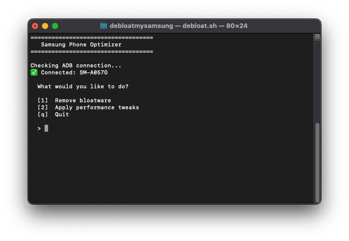

# Debloat Samsung Devices

Interactive terminal tool to remove Samsung bloatware and apply performance tweaks — no root required.



## Setup

1. Install ADB — macOS: `brew install android-platform-tools`
2. On your phone: Settings → About Phone → tap **Build number** 7 times → Developer options → enable **USB Debugging**
3. Connect via USB, tap **Allow** on the popup
4. Edit the `ADB=` line at the top of `debloat.sh` to match your ADB path (`which adb`)

## Run

```bash
chmod +x debloat.sh && ./debloat.sh
```

## Controls

| Input | Action |
|-------|--------|
| number | Toggle item |
| `a` / `n` | Select all / none |
| `r` | Apply/remove selected |
| `b` | Back |
| `q` | Quit |

## What's covered

**Bloatware** — Bixby, Game Launcher, AR Emoji, Samsung Cloud, Smart Switch, Device Care, Galaxy Store, Facebook pre-installs, OneDrive, Hiya, Samsung Free, and more. Optional Google apps (YouTube, Gmail, Maps) also listed but off by default.

**Performance tweaks** — disable/speed up animations, limit background processes (persists after reboot), force GPU rendering, disable Samsung GOS throttling, clear all caches, disable RAM Plus/ZRAM (4GB+ only).

## Restore any removed app

```bash
adb shell cmd package install-existing <package.name>
```
